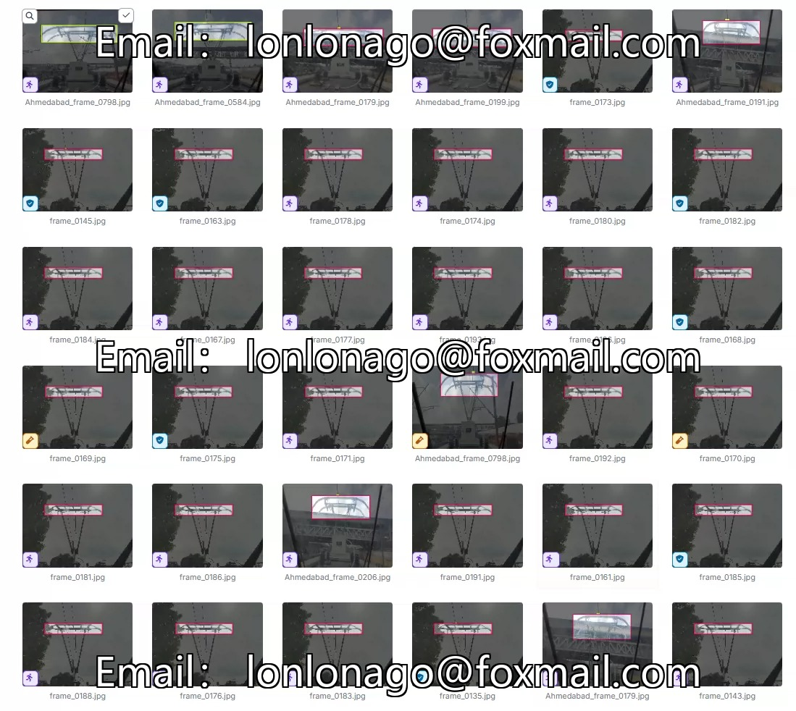
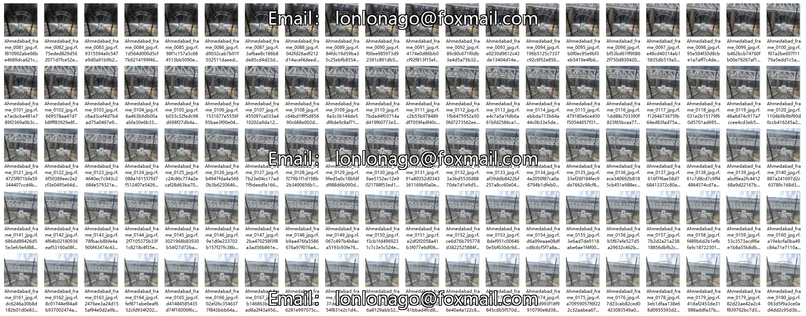
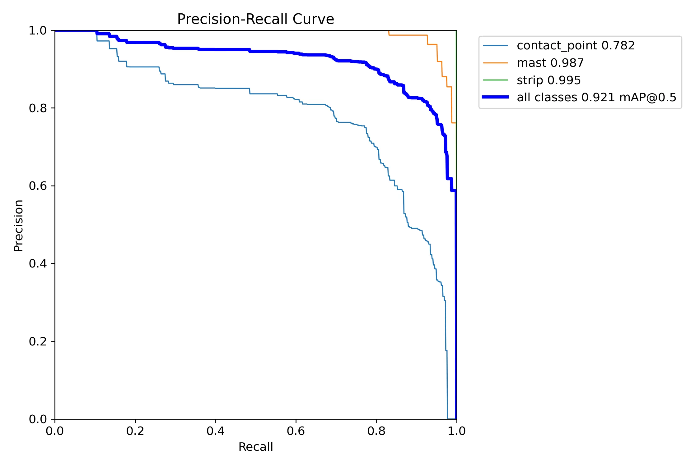
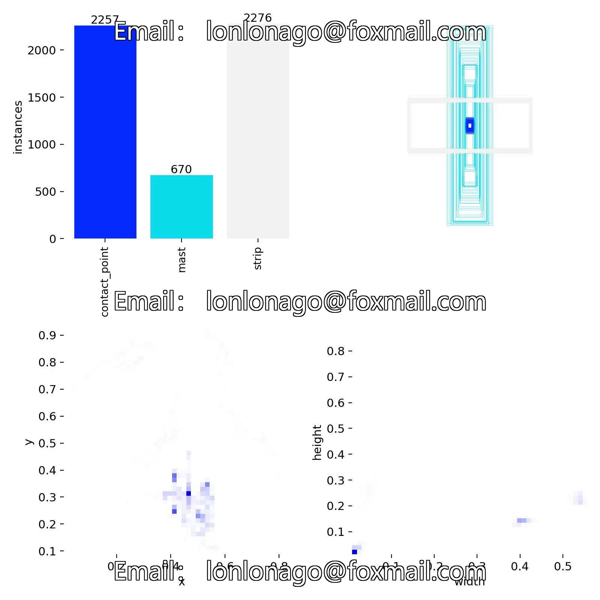
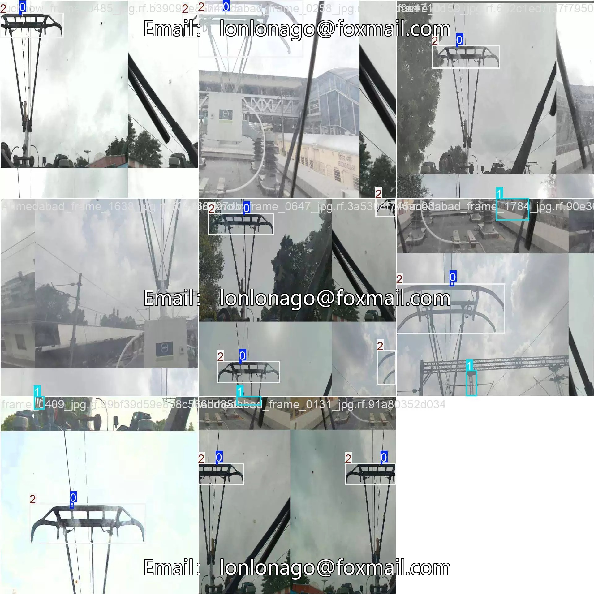
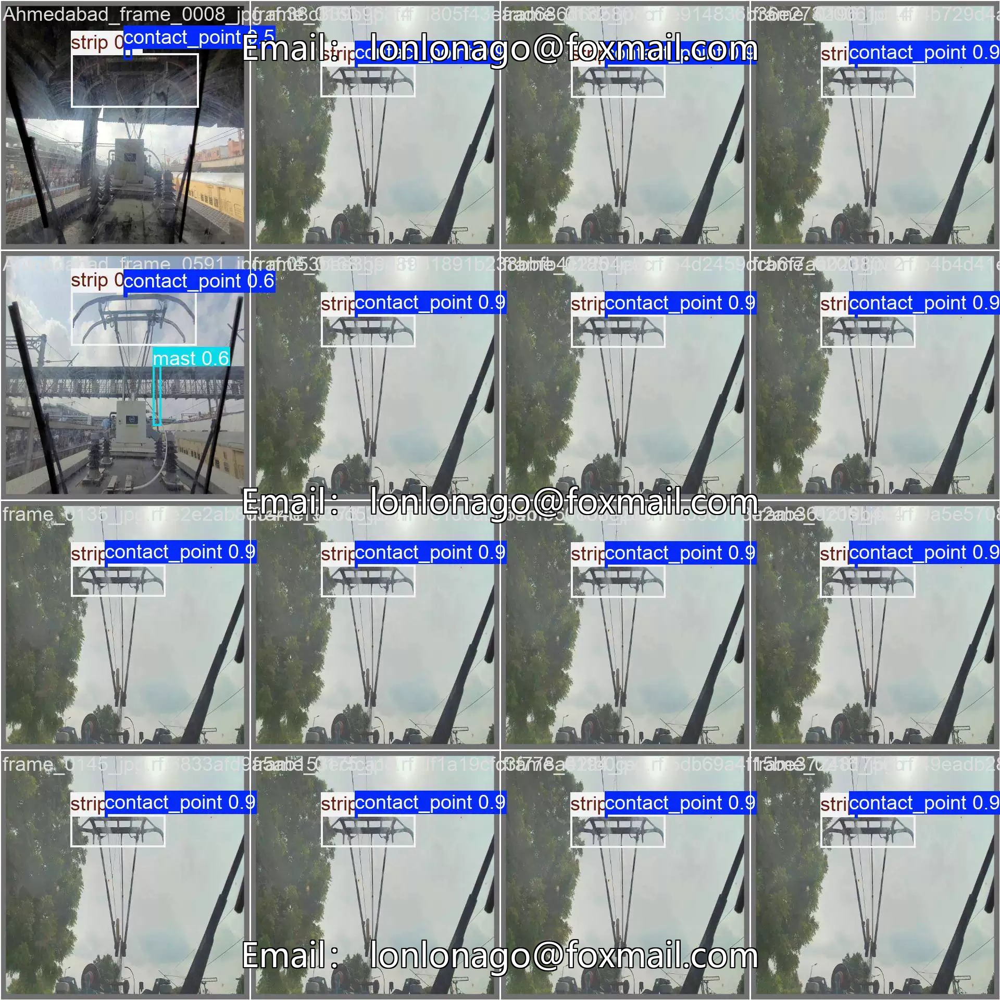

## Body

The high-speed rail catenary target detection dataset in YOLO format consists of 2676 images, labeled and divided into train (2275), valid (265), and test (136) sets. The dataset is divided into three categories: contact point, mast, and strip.

The YOLOv8s weight file (with 100 training rounds and the pre-trained model YOLOv8s.pt, mAP@0.5 0.921) is included with the training results file.

## Images

Here is a pay link on Stripe ( https://buy.stripe.com/3cs8yP7sY87d0vu9AB ). Please contact me lonlonago@foxmail.com after funding $89, and I will send you a complete data files , thank you!

